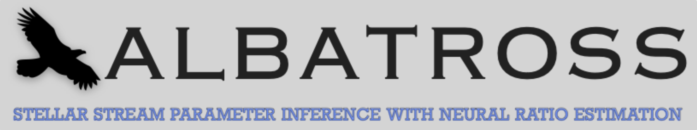
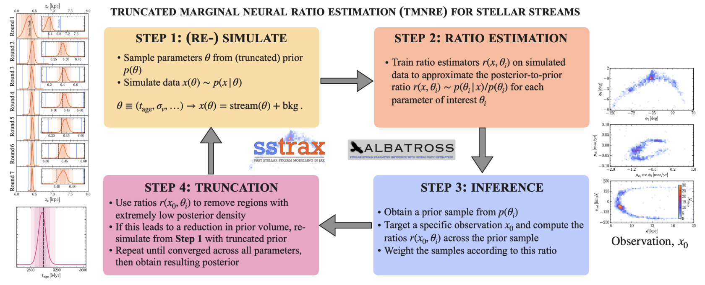

----
### Description

- **Albatross** is a Simulation-based Inference (SBI) library designed to perform analysis on Milky Way stellar streams. It is built on top of the [swyft](https://swyft.readthedocs.io/en/lightning/) code, which implements neural ratio estimation to efficiently access marginal posteriors for all parameters of interest.
- **Related paper:** The details regarding the implementation of the TMNRE algorithm and the specific demonstration for mock GD1-like stellar streams can be found in [arxiv:2304.02032](https://arxiv.org/abs/2304.02032).
- **Modelling Code:** In paralell, we develop a `jax`-accelerated modelling code [`sstrax`](https://github.com/undark-lab/sstrax)  which is available for download from [this repo](https://github.com/undark-lab/sstrax).
- **Key benefits:** We showed in the above paper that albatross is extremely sample efficient when constraining e.g. the 16 parameters in our current model, requiring only 350,000 simulations to perform inference across the full parameter space. The method is also an 'implicit likelihood' technique, so it inherits all the associated advantages such as the fact that it does not require an explicit likelihood to be written down. This opens up the possibility of using albatross to analyse a wide range of interesting physical effects relevant to stellar streams, their environment and evolution history.
- **Contacts:** For questions and comments on the code, please contact either [James Alvey](mailto:j.b.g.alvey@uva.nl), [Mathis Gerdes](mailto:m.gerdes@uva.nl) or [Christoph Weniger](mailto:c.weniger@uva.nl). Alternatively feel free to [open an issue](https://github.com/undark-lab/albatross/issues/new).
- **Citation:** If you use albatross in your analysis, or find it useful, we would ask that you please use the following citation.
```
@article{Alvey:2023pkx,
    author = "Alvey, James and Gerdes, Mathis and Weniger, Christoph",
    title = "{Albatross: A scalable simulation-based inference pipeline for analysing stellar streams in the Milky Way}",
    eprint = "2304.02032",
    archivePrefix = "arXiv",
    primaryClass = "astro-ph.GA",
    month = "4",
    year = "2023"
}
```
- **ASCL Code Record:** Please also see the dedicated ASCL code record: <a href="https://ascl.net/2306.009"></a>

----
## Recommended Installation Instructions

### Environment Setup
The safest way to install the dependencies for `albatross` is to create a virtual environment from `python>=3.8`

**Option 1 (venv):**
```
python3 -m venv /your/choice/of/env/path/
```
- Source the new environment
```
source /your/choice/of/env/path/bin/activate
```

**Option 2 (conda):**
```
conda create -n your_env_name python=3.x (python>=3.8 required)
conda activate your_env_name
```

### Code Installation
- Clone the peregrine repo into location of choice
```
cd /path/to/your/code/store/
git clone git@github.com:undark-lab/albatross.git  # for ssh install
(or git clone https://github.com/undark-lab/albatross.git  # for https install)
```
- Install the relevant packages including e.g. [`swyft`](https://github.com/undark-lab/swyft) and [`sstrax`](https://github.com/undark-lab/sstrax)
```
pip install git+https://github.com/undark-lab/swyft.git
pip install tensorboard psutil configparser pathlib

cd /path/to/your/code/store/
git clone git@github.com:undark-lab/sstrax.git  # for ssh install
(or git clone https://github.com/undark-lab/sstrax.git  # for https install)
cd sstrax
pip install .
```
Additional instructions, documentation and examples for the `sstrax` code can be found at the [corresponding repo](https://github.com/undark-lab/sstrax)

----
## Running albatross



Key run files:
- `generate_observation.py` - Generates a test observation from a configuration file given a set of injection parameters
- `tmnre.py` - Runs the TMNRE algorithm given the parameters in the specified configuration file
- `coverage.py` - Runs coverage tests on the logratio estimators that have been generated by `tmnre.py`

Example Run Scheme:
- Step 1: Generate a configuration file following the instructions in the [examples directory](./examples/configs). To just do a test run, you will only need to change the `store_path` and `obs_path` options to point to the desired location in which you want to save your data.
- Step 2: Change directory to `albatross/albatross` where the run scripts are stored
- Step 3: Generate an observation using `python generate_observation.py /path/to/config/file.txt` or point to a desired observation in the configuration file
- Step 4: Run the inference algorithm using `python tmnre.py /path/to/config/file.txt`, this will produce a results directory as described below
- Step 5: (optional): Run the coverage tests using `python coverage.py /path/to/config/file.txt n_coverage_samples` (`n_coverage_samples = 2000` is usually a good start)

Result output:
- `config_[run_id].txt` - copy of the config file used to generate the run
- `bounds_[run_id]_R[k].txt` - bounds on the individual parameters from Round `k` of the algorithm
- `coverage_[run_id]/` - directory containing the coverage samples if `coverage.py` has been run
- `logratios_[run_id]/` - directory containing the logratios and samples for each round of inference (stored in files `logratios_R[k]` for each round `k`. These can be loaded using the `pickle` python library)
- `observation_[run_id]` - `pickle` file containing the observation used for this run as a `swyft.Sample` object. The same observation is used for both the TMNRE algorithm and any traditional sampling approach.
- `param_idxs_[run_id].txt` - A list of parameter IDs that can be matched to the logratios results files and used for plotting purposes.
- `simulations_[run_id]_R[k]/` - `Zarrstore` directory containing the simulations for Round `k` of inference
- `trainer_[run_id]_R[k]/` - directory containing the information and checkpoints for Round `k` of training the inference network. This directory can also be passed to `tensorboard` as `tensorboard --logdir trainer_[run_id]_R[k]` to investigate the training and validation performance.
- `log_[run_id].log` - Log file containing timing details of run and any errors that were raised

----
## Release Details
- v0.0.1 | *April 2023* | Initial release based on [arxiv:2304.02032](https://arxiv.org/abs/2304.02032). Corresponding `sstrax` release: [`v0.0.1`](https://github.com/undark-lab/sstrax/releases/tag/v0.0.1).
